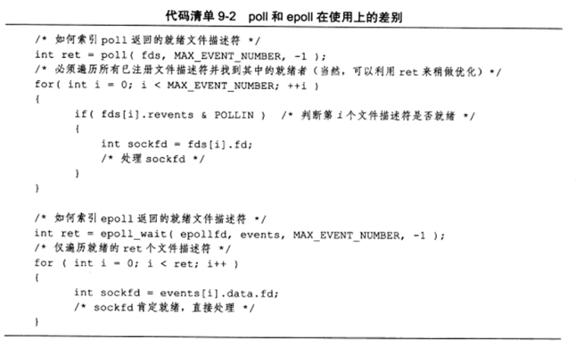
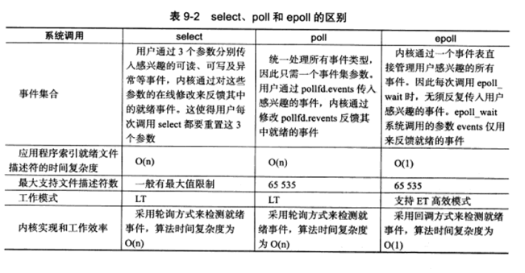

# I/O复用

I/O复用使得计算机能同时监听多个文件描述符。一般在以下情况需要用到I/O复用技术

* 客户端程序要同时处理多个socket
* 客户端程序要同时处理用户输入和网络连接
* TCP服务器要同时监听socket和连接socket
* 服务器要同时处理TCP请求和UDP请求
* 服务器要同时监听多个端口，或者处理多种服务

**虽然I/O复用能监听多个文件描述符，但其本身是阻塞的。**


## select

select系统调用：在一段指定的时间内，监听用户感兴趣的文件描述符上的可读、可写、异常等情况。

### API

  ```
  #include <sys/select.h>
  int select(int nfds, fd_set* readfds, fd_set* writefds, fd_sert* exceptfds,
  		   struct timeval* timeout)
  ```

  * nfds：指定被监听的文件描述符总数。它通常被设置为所有文件描述符的最大值 + 1。[是否可以理解为其监听对象是从文件描述符 0 到 给定的文件描述符 n - 1]

  * readfds，writefds，exceptfds 分别指向可读，可写，异常事件对应的文件描述符集合。调用select时，先向里面传递我们感兴趣的文件描述符，内核将会在函数返回时修改它们。

    ```
    struct fd_set{
    	_fd_mask fds_bits[_FD_SETSIZE / _NFDBITS]
    }
    ```

    可见在fd_set结构体中，只包含了一个整型数组，该数组的每个元素的每一位标记一个文件描述符。

    我们采用宏来访问 fd_set 的具体内容。

    ```
    FD_ZERO(fd_set* fdset);
    FD_SET(int fd, fd_set* fdset);
    FD_CLR(int fd, fd_set* fdset);
    int FD_ISSET(int fd, fd_Set* fdset);
    ```
    
  * timeout：设置select 的超时时间，其结构入下，传递为NULL时将会阻塞直到时间发生。
  
    ```
    struct timeval{
    	long tv_sec;	//s
    	long tc_usec;	//ms
    }
    ```
  
  * 返回值：返回就绪文件描述符的总数，如果超时则返回0。失败返回 -1，并设置errno。

    

### 就绪条件

  我们认为，当以下事件发生时，文件描述符已经就绪。

**可读情况**

  * 接受缓冲区的字节数大于等于低水位（SO_RCVLOWAT）,这代表我们可以读取接收缓冲区。

  * socket通信的对方关闭连接，此时读操作将返回 0。

  * 监听socket有新的请求。

  * socket有未处理的错误，此时我们可以通过getsockopt来读取和清除该错误。

**可写情况**

  * 发送缓存区的字节数大于等于低水位（SO_SNDLOWAT）

  * socket的写操作被关闭

  * 使用非阻塞connect连接成功或失败后

  * 未处理错误


### 带外数据

虽然我们可以使用select来处理正常的数据和带外的数据，但其两者是不同的。前者是可读状态，后者则是异常。


## poll

其与select系统调用类似，在指定时间内轮询一定数量的文件描述符，以观察其是否就绪。

```
#include <poll.h>
int poll(struct pollfd* fds, nfds_t nfds, int timeout);
```

* fds 指定我们感兴趣的文件描述符，其如下面格式

  ```
  struct pollfd{
  	int fd;			//文件描述符
  	short events;	//注册事件
  	short revents;	//实际发送的事件
  }
  ```

  其中关键在于我们注册的事件。事件也是按照位的形式注册的，其具体由如下构成

  | 事件       | 描述                              | 是否可作为输入 | 是否可作为输出 |
  | ---------- | --------------------------------- | -------------- | -------------- |
  | POLLIN     | 数据可读                          | 是             | 是             |
  | POLLRDNORM | 普通数据可读                      | 是             | 是             |
  | POLLRDBAND | 优先级带数据可读                  | 是             | 是             |
  | POLLPRI    | 带外数据可读                      | 是             | 是             |
  | POLLOUT    | 数据可写                          | 是             | 是             |
  | POLLWRNORM | 普通数据可写                      | 是             | 是             |
  | POLLWRBAND | 优先级带数据可写                  | 是             | 是             |
  | POLLRDHUP  | 对方关闭TCP连接（对方关闭写端口） | 是             | 是             |
  | POLLERR    | 错误                              | 否             | 是             |
  | POLLHUP    | 挂起（关闭写端口）                | 否             | 是             |
  | POLLNVAL   | 文件描述符没有打开                | 否             | 是             |
  
* nfds 参数指定监视的文件描述符数量，其实际上是个unsigned long int 类型

* 超时值，单位为毫秒


## epoll

在之前的系统调用中，select 和 poll 都由内核查询注册的事件发生情况。而对于epoll而言，其自己本身就是一个文件描述符。

### epoll_create

```
#include <sys/epoll.h>
int epoll_create(int size);
```

* size 参数提示系统需要的事件数目，实际上不起作用。


### epoll_ctl

创建了epoll 文件描述符后，我们需要同样也需要注册我们关心的事件。

```
int epoll_ctl(int epfd, int op, int fd, struct epoll_event *event)
```

* epfd：代表我们创建的epoll文件描述符

* op：指定操作类型

  | EPOLL_CTL_ADD  | EPOLL_CTL_MOD  | EPOLL_CTL_DEL      |
  | -------------- | -------------- | ------------------ |
  | 注册fd上的事件 | 修改fd上的事件 | 删除fd上的注册事件 |

* event 指定事件，其实际上是包括了poll的事件再加上用户数据。

  ```
  struct epoll_event{
  	_uint32_t events;
  	epoll_data_t data;
  }
  ```

  * 其中，前者就是我们之前介绍到按位或的事件，唯一区别在于宏之间加上 **E** 。

  * 后者则是我们的用户数据，其如下构成

    ```
    typedef union epoll_data{
    	void* ptr;
    	int fd;
    	uint32_t u32;
    	uint64_t u64;	
    } epoll_data_t
    ```

    在这个联合体内，我们使用最多的是 fd，用来指定事件从属的文件描述符。

### epoll_wait

注册事件后，我们就可以开始监控事件的发生情况了。

```
int epoll_wait(int epfd, struct epoll_event* events, int maxevents, int timeout)
```

与之前的两个函数一样，我们也需要检查event才能知道到底发生了什么。但是和之前的区别在于，**这里的events 全部都是就绪事件**。而之前的poll 和select 则需要我们比较注册时的事件 和 就绪事件。

下图体现了它们使用上的区别。

  

### LT 和 ET

epoll 还有一个特点在于我们可以设置其电平触发和边缘触发。默认情况下，其是电平触发。两者的区别在于，电平触发时，我们可以不立即处理该事件，则信号会持续触发。而边缘触发就只会触发一次。因此ET会更高效。


### EPOLLONESHOT

就算我们使用了边缘触发，但还是有可能会触发多次，因为边缘可能会来的很密集。如果我们希望在一个时刻只能由一个线程来处理事件，那么我们可以使用oneshot模式，其只会触发一次。

当然，工作线程处理完了之后，我们需要手动reset一下，不然这个信号就永远不会来了。


## 三者的比较

* 均带有定时器
* 返回值的含义是一致的
* 事件集不同，select中要分别定制 三种文件描述符的集合，poll 则是利用pollfd，内核只需要修改里面的revent即可，而epoll则是利用事件表的形式。其中event_wait里面的events是和输入分离的，因此我们不需要再修改。
* select 和 poll 都只用 LT模式，而epoll可以边缘触发
* select都是轮询模式，而epoll_wait实际上是回调。

