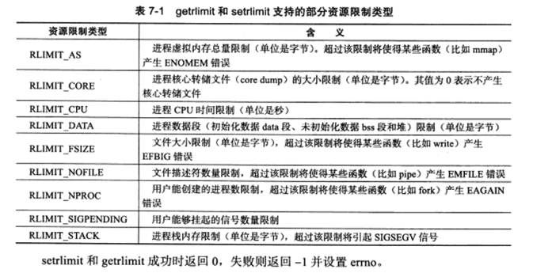

# Linux服务器程序规范

在服务编程中，除了网络通信之外还有许多事情要做：

* Linux服务器程序一般以后台进程形式运行。后台进程又称为守护进程。其没有控制终端，其父进程一般为init进程 pid=1。

* 日志系统，至少能输出日志到文件。
* 以某个非root身份运行。
* 程序可配置，除了命令行之外，一般还能通过配置文件更改。
* 启动时生成一个pid文件，以记录该后台进程的pid。
* 资源等限制。


## 日志

我们可以通过Linux系统日志来保存我们的后台日志。系统自带syslogd进程，可以帮我们记录日志，当然现在已经被更先进的rsyslogd取代了。

其具体操作如下：用户进程通过调用syslog函数生成系统日志。该函数将日志输出到一个unix本地域socket类型（即af_unix）的文件/dev/log中，rsyslogd进程则监听该文件以获取用户程序的输出。然后守护进程会将日志输出到特定的日志文件中去(/var/log/debug 或者/var/log/message 或者 /var/log/kern.log)。

```
#include <syslog.h>
void syslog(int priority, const char* message, ...);
```

优先级代表设施 和 日志级别的 按位或。我们设施一般使用LOG_USER，

我们可以改变日志的输出方式

```
void openlog(const char* ident, int logopt, int facility);
```

ident参数指定的字符串将被添加到日志消息的日期和时间之后。

我们还可以设置日志的过滤选项，日志级别大于maskpri的将被忽略。

```
int setlogmask(int maskpri)
```

关闭日志

```
void closelog();
```


## 用户信息

大部分后台进程要求以root身份启动，但不能以root身份进行。下面的函数可以获取和设置当前进程的真实用户ID(UID),有效用户ID(EUID),真实组ID(GID)和有效组ID(EGID)；

```
#include <sys/types.h>
#include <unistd.h>

uid_t getuid();
uid_t geteuid();
gid_t getgid();
gid_t getegid();
int setuid(uid_t uid);
int seteuid(uid_t uid);
int setgid(gid_t gid);
int setegid(gid_t gid);
```

一个进程拥有两个用户ID：UID 和 EUID。EUID存在的目的是方便资源访问：它使得运行程序的用户拥有该程序的有效用户的权限。


## 进程组

在Linux下，每个进程都隶属于一个进程组，因此进程除了PID之外，还具有进程组信息PGID。我们可以通过如下函数获取进程组信息

```
pid_t getpgid(pid_t pid);
```

每个进程组都有一个首领进程，其pid 和 pgid 相同，实际上获取进程组id就是获取首领进程的pid。进程组将一直存在，除非所有进程都退出或者加入了其他组。

我们可以将当前进程加入其他进程组

```
int setpgid(pid_t pid, pid_t pgid);
```

该函数将pid加入pgid进程组。注意一个进程只能设置自己或者其子进程的进程组。


## 会话

一些有关联的进程组将形成会话。

```
pid_t setsid(void);
```

该函数不能由首领进程调用。对于非首领进程调用的情况，其会产生一个新的会话：

* 调用进程成为会话的首领，此时该进程是会话的唯一成员
* 新建一个进程组，其pgid就是调用进程的pid，调用进程自动成为首领
* 调用进程将甩开终端

该函数返回新的进程组的pgid，我们可以认为该函数的作用是将调用进程从原先的进程组分离出来，自己组成一个新的进程组和会话。

Linux系统默认会话首领所在的进程组PGID就是SID

```
pid_t getsid(pid_t pid)
```


## 系统资源限制

我们可以通过如下一对函数来读取和设置系统资源的限制

```
#include <sys/resource.h>
int getrlimit(int resource, struct rlimit* rlim);
int setrlimit(int resource, const struct rlimit* rlim);

sturct rlimit{
	rlim_t rlim_cur;
	rlim_t rlim_max;
}
```

其含义也相对简单，rlimit结构体中保存的是资源的软限制（建议使用情况）和上限值。

resource 参数指定我们要改变的资源类型。




## 改变工作目录和根目录

我们可以读取程序的当前运行目录并改变它。

```
char* getcwd(char* 	buf, size_t size);
int chdir(const char* path);
```

buf用于保存当前运行目录，如果长度超过了size，则返回NULL。

对于进程来说，其根目录并不就是 / 目录，比如web的根目录是 /var/www

```
int chroot(const char* path);
```

只有特权进程才能改变根目录。


## 后台化

想要让进程在后台执行，我们需要创建子进程。

```
int daemon(int nochdir, int noclose);
```

前者为1不改变工作目录，为0变为 `/`。后者为0标准输入输出/错误被重定向到/dev/null文件，为1不改变。