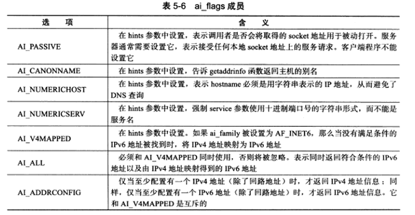
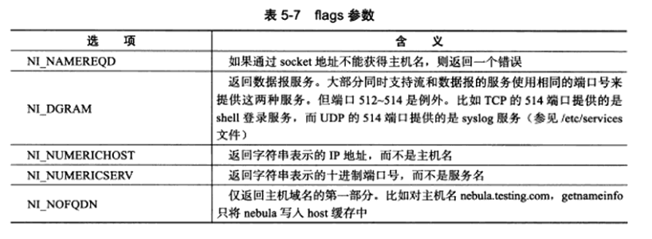
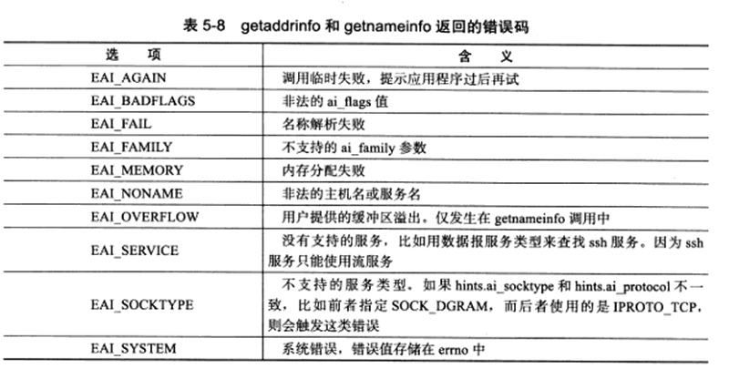

# Linux 网络编程基础API

## 地址

### 字节序

在现代操作系统中，对于长度超过n个字节的变量（n 指操作系统的位数，为了方便我们理解，下面的 n 取成了1，实际上一般是 4/8 个字节。），我们通常都需要将其顺序地摆放在一起。就像一个 `7546H  `的数据，我们要将其分为两个字节 `75H` 和 `46H` 。那么这两字节哪个在前哪个在后呢？

* 大端字节序：高位字节存在低地址处，低位字节存在高地址处。（网络）
* 小端字节序：高位存在高地址处，低位存在低地址处。（主机）

现在的PC机大多数都采用了小端字节序的方法来保存数据。为了保证不同的字节序的主机能够正确通信，我们定义网络字节序为大端序，只有满足网络字节序的数据才能被正确的发送。因此，我们在发送的时候，必须要将我们的主机字节序转换成为网络字节序。

```
// 主机序转换成网络序,h:host n:net, s:short, l:long
unsigned long int htonl(unsigned long int hostlong);
unsigned short int htons(unsigned short int hostshort);

unsigned long int ntohl(unsigned long int netlong);
unsigned short int ntohs(unsigned short int netshort);
```

### socket 地址

对于一个socket而言，其地址定义在如下的结构体中

```
struct sockaddr{
	sa_family_t sa_family;
	char sa_data[14];
}
```

其中地址组`sa_family`用于选择其协议族类型：`AF_UNIX,AF_INET,AF_INET6`。

由上述可以看出，要保存一个网络地址并不简单，其 14 字节的数组并不一定能够保存所有类型的网络地址：unix类型最多需要108字节，IPV4类型的需要 6 字节，IPV6类型的需要 26 字节。因此一个通用的地址结构体被定义

```
struct sockaddr_storage{
	sa_family_t sa_family;
	unsigned long int __ss_align;
	char __ss_padding[128-sizeof(__ss_align)];
}
```

可以看到，为了保证字节对齐，`__ss_align`变量是毫无意义的。

但是之前的这些都很难填写啊，而且协议族就那么多，我们完全可以为了每个协议族都构建一个专属的地址结构体。

* unix 结构体

  ```
  struct sockaddr_un{
  	sa_family_t sa_family;
  	char sun_path[108];
  }
  ```
  
* TCP/IP(ipv4)结构体

  ```
  struct sockaddr_in{
  	sa_family_t sa_family;
  	u_int16_t sin_port; 	//端口号
    	struct in_addr sin_addr;
  }
  struct in_addr{
  	u_int32_t s_addr;		//地址
  }
  ```

* TCP/IP(ipv6)结构体

  ```
  struct sockaddr_in6{
  	sa_family_t sa_family;
  	u_int16_t sin6_port;	//端口号
  	u_int32_t sin6_flowinfo;	//流信息：设置为0
  	struct in6_addr sin6_addr;	//地址
  	u_int32_t sin6_scope_id;
  }
  struct in6_addr{
  	unsigned char sa_addr[16];
  }
  ```

### 地址转换函数

通常情况下，我们的地址并不是普通的二进制串，而是利用点分十进制来表示的。下面的函数可以帮助我们从两者之间相互转换。

* IPV4专用函数

```
#include <arpa/inet.h>
in_addr_t inet_addr(const char* strptr);
int inet_aton(const char* cp, struct in_addr* inp);
char* inet_ntoa(struct in_addr in);
```

`inet_addr`将点分十进制的地址转换成用网络字节序表示的地址。后面的`inet_aton` 将点分十进制的地址直接转换并保存到`inp`中去，`inet_ntoa`则相反。

* IPV4/IPV6通用函数

```
int inet_pton(int af, const char* src, void* dest);
const char* inet_ntop(int af, const void* src, char* dst, socklen_t cnt);
```

第一个函数很好理解，因为不知道具体的版本号，所有加上了一个af的变量获取。第二个函数将地址从地址变量中提取出来，并保存到返回指针中去，由于这是一个指向常量的指针，因此我们无法再修改其中的内容。注意到我们传入的指针并不是常量，此外，我们传入的src是一个void指针，因此编译器无法判断其具体的内存大小，因此我们还需要传入一个长度变量。


## socket

### 1. 创建

在Linux系统中，所有的东西都被认为是一个文件，因此socket套接字也是一个文件。正是基于以上理由，套接字的类型就变成了文件描述符。

```
#include <sys/socket.h>

int socket(int domian, int type ,int protocol)
```

其中domain指协议族，type指服务类型（基于流还是数据报），最后一位指具体协议（可以写0表示默认）。

### 2. 命名（绑定）

在创建了socket后，系统知道存在这样的文件，但是不知道这个套接字使用的地址等信息。将套接字和地址绑定就被称为是命名。在服务器中，我们需要命名，因为只有命名了客户端才能知道其信息，而在客户端则不用。

```
int bind(int sockfd, const struct sockaddr* my_addr, socklen_t addrlen);
```

### 3. 监听

命令之后，我们并不能马上接收到信息，而是需要构建一个监听队列。

```
int listen(int sockfd, int backlog);
```

backlog参数指定了处于完全链接状态的socket的上限。如果超过该值，则系统不再受理新的客户端连接请求。

### 4.  接受连接

```
int accept(int sockfd, struct sockaddr* addr, socklen_t *addrlen);
```

我们稍微讲解下这里的形参为什么是这样的，接受连接请求我们需要找到的是客户端socket，而客户端的地址等信息我们是不知道的，因此我们要留出一块内存地址用来填写这些信息，与之对应的地址长度也是需要用指针形式传递的。换句话说，这个函数输入我们的监听socket，返回连接socket 和 指针传递其对应的地址信息。

### 5. 发起连接

自然有接受连接，肯定也有发起连接请求的函数。该函数由客户端执行。

```
int connnect(int sockfd, const struct sockaddr* serv_addr, socklen_t addrlen);
```

与绑定类似，将自身的套接字与我们的目标地址关联，即对该地址发起连接请求。

### 6. 关闭连接

由于套接字也是文件，因此和关闭文件的方式是一致的。

```
int close(int sockfd);
```

但是这种方式存在一个问题，原因在于该方法类似于信号量和智能指针，只是将引用减一，直到为0时才会关闭。因此，我们可以强行关闭它

```
int shutdown(int sockfd, int howto);

howto:SHUT_RD, SHUT_WR, SHUT_RDWR 分别表示了关闭 读/写/读写流
```

一般情况，推荐使用shutdown来关闭套接字。

### 7. 数据交换

* 我们可以直接用文件的读写函数

```
ssize_t read(int fd, void* buff, size_t n_bytes);
ssize_t write(int fd, const void* buff, size_t n_bytes);
```

* 当然，系统也为套接字专门准备了一套IO函数

```
ssize_t recv(int sockfd, void* buff, size_t len, int flags);
ssize_t send(int sockfd, const void* buff, size_t len, int flags);
```

与文件的读写相比，区别仅在于可以设置传输的标志。其中逻辑有：


* 此外，更具体的，我们还有专门针对UDP的数据读写

```
ssize_t recvfrom(int sockfd, void* buff, size_t len, int flags, 
				 struct sockaddr* src_addr, socklen_t* addrlen);
ssize_t sendto(int sockfd, const void* buff, size_t len, int flags
			   const struct sockaddr* dest_addr, socklen_t addrlen);
```

相较于之前，我们可以看到，UDP读写里面还增加了套接字的具体地址，这是因为UDP无连接，每次数据传递的时候都是需要地址信息的，接受的时候发送端是未知的，因此只用普通的指针。而发送的时候是有针对性的，因此后两个参数是已知的。

* 更一般的，系统还设置了通用的IO函数

```
ssize_t recvmsg(int sockfd, struct msghdr* msg, int flags);
ssize_t sendmsg(int sockfd, struct msghdr* msg, int flags);

struct msghdr{
	void* msgname;				//socket的地址
	socklen_t msg_namelen;		//地址长度
	struct iovec* msg_iov;		//发送的内存块
	int msg_iovlen;				//内存块数目
	void* msg_control;			//辅助数据的base
	socklen_t msg_controllen;	//辅助数据的数量
	int msg_flags;				//复制flags，并更新
}

struct iovec{
	void* iov_base;				//内存块基址
	size_t iov_len;				//这块内存块的大小
}
```

### 8. 地址信息

我们可以通过socket来获取其的连接信息。

```
int getsockname(int sockfd, struct sockaddr* addr, socklen_t* addrlen);
int getpeername(int sockfd, struct sockaddr* addr, socklen_t* addrlen);
```

前者获取本端的socket地址，而或者获取远端的地址。


## 网络信息

* 域名信息

在之前我们命名套接字时，都需要IP和端口信息。但每次都要输入这些实在不方便，我们可以将其解析到域名和服务中去。

```
#include <netdb.h>
struct hostent* gethostbyname(const char* name);
struct hostent* gethostbyaddr(const void* addr, size_t len, int type);
//type指网络类型（AF_INET or AF_INET6）

struct hostent{
	char* h_name;		//主机名
	char** h_aliases;	//别名
	int h_addrtype;		//地址族
	int h_length;		//地址长度
	char** h_addr_list;	//IP地址列表
}
```

* 服务信息

上面的函数帮助我们得到连接的域名信息，下面的则是帮我们获取服务（即端口号）

```
struct servent* getservbyname(const char* name, const char* proto);
struct servent* getservbyport(int port, const char* proto);

struct servent{
	char* s_name;
	char** s_aliases;
	int s_port;
	char* s_proto; //"tcp","udp",NULL 三种可选
}
```

name指定目标服务的名称，port则通过端口来获取服务信息。

* 通用信息

下面的函数既能帮我们获取IP，又能获取端口。

```
int getaddrinfo(const char* hostname, const char* service, 
				const struct addrinfo* hints, struct addrinfo** result);
```

相较于之前的函数二选一，此处的hostname又可以是域名也可以是ip，service既可以是服务也可以是端口。hints相当于一个提示，result则以链表形式保存了输出。

```
struct addrinfo{
	int ai_flags;
	int ai_family;  			// 		
	int ai_socktype;			//
	int ai_protocol;			//
	socklen_t ai_addrlen;		// ar_addr 长度
	char* ai_cannonname;		// 主机的别名
	struct sockaddr* ai_addr;	// 地址信息
	struct addrinfo* ai_next;	// 下一个对象
}
```

大部分的参数都很好理解，主要时ai_flags，其可以由下面的标志或得到。



对于hint参数，只能设置前四个参数，其他均为NULL。

**此外和其他函数不同，由于存在链表，所以result是在堆上分配了内存的，因此我们需要释放**

```
void freeaddrinfo(addrinfo* res);
```


* socket信息

我们也可以通过socket来获取主机和服务信息。

```
int getnameinfo(const struct sockaddr* s_addr, socklen_t addrlen, char* host,
				socklen_t hostlen, char* serv, socklen_t servlen, int flags)
```

其参数也很简单，稍微看下flags。



后两个函数`getnameinfo`和`getaddrinfo`成功时返回0，失败返回错误码。



该错误码是数值的形式保存的，我们如果要看的话就要先转换成字符串形式

```
const char* gai_strerror(int error)
```

