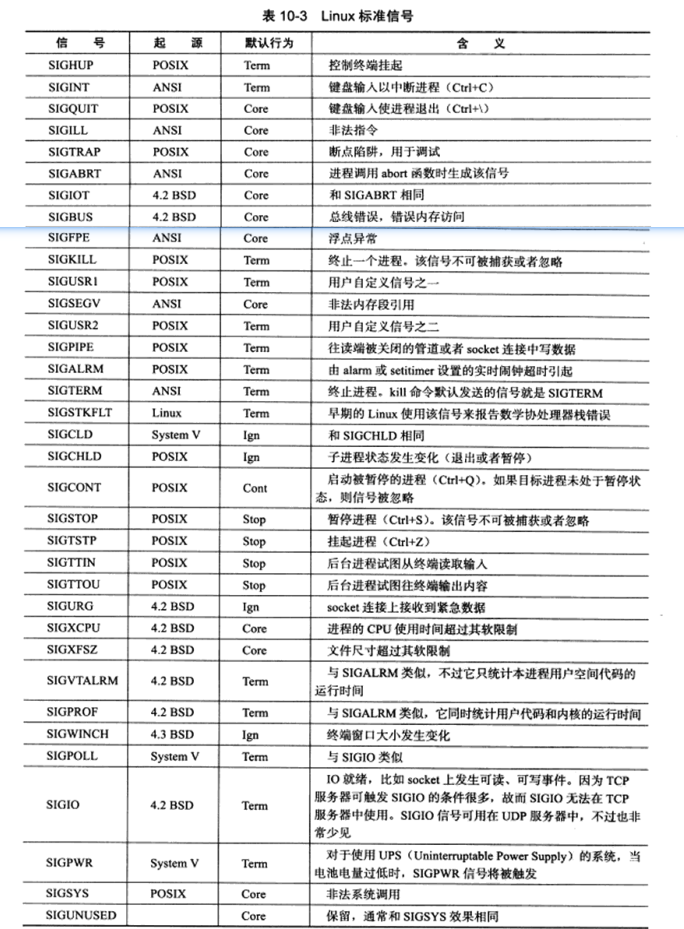

# 信号

信号是由用户，系统或者进程发送给目标进程的信息。其可以由以下的条件产生：

* 对于前台进程，可以输入特殊的终端命令，如ctrl + c
* 系统异常
* 系统状态变换
* 运行kill


## 信号概述

### 发送

在前面我们可以直到，对于程序而言，我们只能使用kill来发送信号。

```
#include <sys/types.h>
#include <signal.h>
int kill(pid_t pid, int sig);
```

该函数将信号sig 发送给目标进程。且对于pid有以下几种情况：

* pid > 0  发送给该进程
* pid = 0 发送给本进程组内所有进程
* pid = -1 发送给除init外的所有进程（有权限时）
* pid < -1 发送给 -pid 进程组的所有进程

### 信号处理

当进程接受到信号时，也要对信号进行处理。

```
#include <signal.h>
typedef void (*__sighandler_t)(int)
```

信号处理函数只带有一个整型的参数，用来接受信号。主要该函数应当是线程安全的。

_sighandler_t，实际上是一个void 类型的仅包含一个int参数的函数。首先我们不需要返回值是比较明显的，其次我们唯一接受的参数实际上就是信号。

### 信号类型




## 信号函数

我们可以为一个信号设置处理函数。

```
#include <signal.h>
_sighandler_t signal(int sig, _sighandler_t _handler)
```

_handler用于指定处理信号的指针。signal函数处理成功时也会返回一个同类型指针，其值是前一次调用时传入的指针参数。

当然我们可以采取更鲁棒的系统调用。

```
#include <signal.h>
int sigaction(int sig, const struct sigaction* act, struct sigaction* oact)
```

显然和之前的类似，函数也保存了之前的调用指针，只不过这次不再是通过返回值返回了。sigaction 的具体细节如下：

```
struct sigaction{
 	void (*sa_handler)(int);
    void (*sa_sigaction)(int, siginfo_t *, void *);
    sigset_t sa_mask;
    int sa_flags;
    void (*sa_restorer)(void);
}
```

* sa_handler此参数和signal()的参数handler相同，代表新的信号处理函数
*  sa_mask 用来设置在处理该信号时暂时将sa_mask 指定的信号集搁置
* sa_flags 用来设置信号处理的其他相关操作，下列的数值可用。 
  * SA_RESETHAND：当调用信号处理函数时，将信号的处理函数重置为缺省值SIG_DFL
  * SA_RESTART：如果信号中断了进程的某个系统调用，则系统自动启动该系统调用
  * SA_NODEFER ：一般情况下， 当信号处理函数运行时，内核将阻塞该给定信号。但是如果设置了SA_NODEFER标记， 那么在该信号处理函数运行时，内核将不会阻塞该信号

## 信号集

我们可以用信号集来表示一组信号。

```
#include <bits/sigset.h>
#define _SIGSET_NWORDS (1024/(8*sizeof(unsigned long int)))
typedef struct{
	unsigned long int __val[_SIGSET_NWORDS];
} __sigset_t
```

从上式我们可见，信号集实际上是一个数组，数组的每个元素的每一位都可以表示一个信号。（类似于fd_set），我们使用如下的API来操作它。

```
#include <signal.h>
int sigemptyset(sigset_t* _set) //清空信号集
int sigfillset(sigset_t* _set)	//设置所有信号
int sigaddset(sigset_t* _set, int _signo)	//添加信号
int sigdelset(sigset_t* _set, int _signo)	//删除信号
int sigismember(const sigset_t* _set, int _signo)	//查看信号是否在信号集中
```

关于fd_set 和 sigset_t ，其实两者还是有较大的不同的，因为信号的数量是有限的，因此系统提供了前两个API，但对于fd而言，其是没有上限的（广义而言）。

### 信号掩码

在信号处理函数中，有一个参数为sa_mask。我们也可以设置和查看进程的信号掩码。

```
#include <signal.h>
int sigprocmask(int _how, _const sigset_t* _set, sigset_t* o_set)
```

显然_set 指定新的信号掩码，而o_set则输出原先的信号掩码。而 _how则指定方式，其有如下选择：

* SIG_BLOCK 新的信号掩码是当前值和指定值的并集
* SIG_UNBLOCK 是和~_set的并集
* SIG_SETMASK 直接设置为指定值

### 信号挂起

**设置信号掩码后，被屏蔽的信号将不能被接受。**也就是说该信号会被挂起，一但我们把该信号的屏蔽取消了，则会被立即被接收到。


## 统一信号源

**信号是一种异步事件。**其类似于中断。我们需要尽快处理信号，这样就不会屏蔽太久。一般我们采取如下的解决方法：

把信号的处理逻辑放到函数的主循环中，当信号被触发时，它只是简单的通知主循环接收到该信号，并把值传递给主循环。主循环再根据接受到的信号值执行对应的逻辑代码。我们可以用管道来传递信号的值。这样信号就和我们的IO一样了。

 