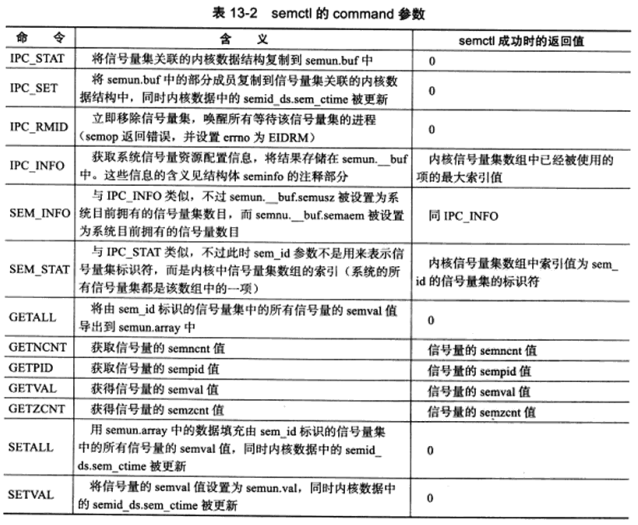

# 多进程编程

## fork

fork的作用是新建一个子进程，其调用形式如下：

```
#include <sys/types.h>
#include <unistd.h>
pid_t fork();
```

该函数的调用返回在主进程中是新进程的pid，而在子进程中则是0。我们利用返回值来判断当前进程。

**fork函数产生的子进程代码与原先代码完全相同，并且它会复制父进程的数据（堆，栈和静态数据），但是pid 和 信号位是不同的。** 注意是写时复制。

## exec

该系统调用允许我们在子进程中执行其他程序。

```
#include <unistd.h>
extern char** environ;

int execl(const char* path, const char* arg, ...)
int execlp(const char* file, const char* arg, ...)
int execle(const char* path, const char* arg, ..., char* const envp[])
int execv(const char* path, char* const argv[])
int execvp(const char* file, char* const argv[])
int execve(const char* path, char* const argv[], ..., char* const envp[])
```

其中file 和path 指定了我们的路径，arg接受可变的参数，而argv则接受数组，它们会被传递给执行程序的main。我们也可以设置envp环境变量，不然则使用environ环境。

## 僵尸进程

子进程结束而父进程未结束的状态。另一种情况是，父进程异常结束，而子进程仍然存活。

主进程可以主动等待子进程结束，然后手动关闭它。

```
#include <sys/types.h>
#include <sys/wait.h>
pid_t wait(int* stat_loc);
pid_t waitpid(pid_t pid, int* stat_loc, int options);
```

wait将阻塞进程，直到子进程运行结束。而waitpid是非阻塞的，如果子进程没有结束，则返回0，如果子进程结束了则返回对应的pid。

## 管道

管道是进程间通信的手段。当然，它也可以在文件描述符之间进行通信。

由于管道的方向是从 0 到 1，因此双向通信的话就必须得设置两个管道。

## 信号量

信号量意味着资源的可用数目。

### 创建semget

```
#include <sys/sem.h>
int semget(key_t key, int num_sems, int sem_flags)
```

* key 用来标志一个信号量，类似与名称
* num_sems 指定信号量的资源，创建时必须指定，获取时则可以设0
* sem_flags 则是标志位
* 该函数在成功时会返回信号量集的数目。

### 使用semop

```
#include <sys/sem.h>
int semop(int sem_id, struct sembuf* sem_ops, size_t num_sem_ops)

struct sumbuf{
	unsigned short int sum_num;
	short int sem_op;
	short int sem_flg;
}
```

* sem_id 是semget调用返回的信号量集标识符。
* sem_ops 指定了我们这次对信号量的原语操作，其中更具体的是
  * sem_num 指定操作信号量集中的具体信号量，0 代表第一个
  * sem_op 指定了我们的具体操作，其值可以是 0， 正， 负。分别代表我们将要对信号量资源的效益不。
  * sem_flg 可以选择为IPC_NOWAIT 和 SEM_UNDO。前者代表了非阻塞，而后者在进程退出时可以取消操作。（感觉不原语了）

* num_sem_ops 指定要执行的操作个数，即sem_ops的个数（也就是说我们不仅可以进行一项操作，而是可以进行一系列操作）

### 控制semctl

我们也可以直接控制这个信号量。

```
#include <sys/sem.h>
int semctl(int sem_id, int sem_num, int command, ...)
```

* sem_id 指定我们要处理的信号量集
* sem_num 指信号集中的编号
* command 则是要执行的命令
* 有些命令需要我们传递第四个参数，具体如下
  * int val / struct semid_ds* buf / unsigned short* array / struct seminfo* _buf 四选一
  * 其他的不再赘述

支持的命令表如下：



从这里我们可以看出，在semget里设置的num，实际上指的是信号集中信号量的数目，而对于信号量的值，是由semctl里通过设置setval来设置的。

### 特殊键值IPC_PRIVATE

semget 的调用者可以给key传递特殊键值。无论该信号量是否已经存在，semget都将创建一个新的信号量。实际上这个信号量并不是私有的，而是新的。


## 共享内存

共享内存是最高效的机制，其不涉及内存间的数据传输。但是同样的我们也需要限制访问条件。

### 创建shmget

```
#include <sys/shm>
int shmget(key_t key, size_t size, int shmflg)
```

类似于semget，key 也是一个键值，size 则指定了该内存的大小，smhflg和semget的标志类似。

## shmat 和shmdt 

在共享内存被创建/获取之后，我们并不能像信号量一样立刻使用。而