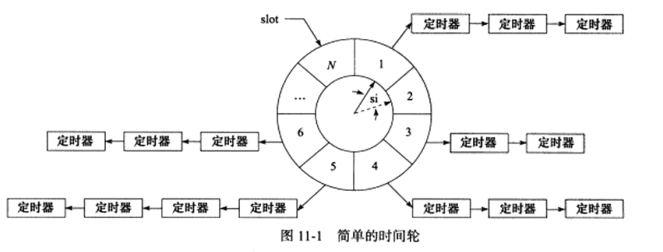

# 定时器

在之前的事件监视器中（select，poll，epoll），我们都设定了监视的时间。但是有时我们也会遇到单纯的只是想倒计时的情况。这时候我们就需要用到定时器。系统为我们提供了以下的三个选择

* socket选项中的SO_RCVTIMEO 和 SO_SNDTIMEO
* SIGALRM信号
* I/O复用中的超时参数


## SO_RCVTIMEO 和 SO_SNDTIMEO

这两分别是socket选项的参数，其设置了系统调用的最长时间。

对其进行设置需要依靠setsockopt函数

```
timeval timeout;
timeout.tv_sec = 1;
timeout.tv_usec = 0;
socklen_t len = sizeof(timeout);
int ret = setsockopt(sockfd, SOL_SOCKET, SO_RCVTIMEO, &timeout, len);
```


## SIGALRM信号

## 超时参数

用超时参数的一个缺点在于，系统有可能会提前返回，所有当提前返回时(返回值大于0)，我们就需要更新超时参数，以使得多段时间之和为我们的目标时间。


## 高性能定时器

### 时间轮



在时间轮中，指针就像钟表一样，以恒定的速度转动。每转动一步就指向下一个槽，这个转动的时间被称为一个嘀嗒，也被称作槽间隔si。对于一个N个槽的时间轮，其转动一周需要N * si时间。每个槽都指向一个定时器链表，显然每个链表上的定时器都相差了一轮。