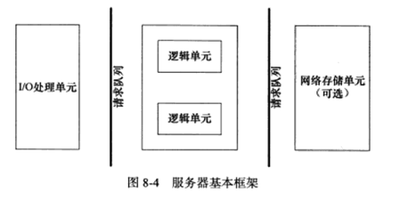
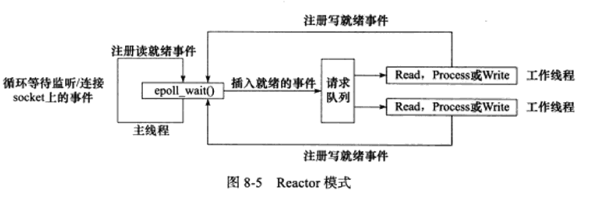
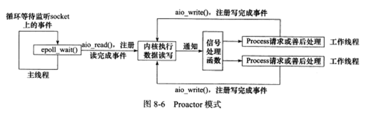
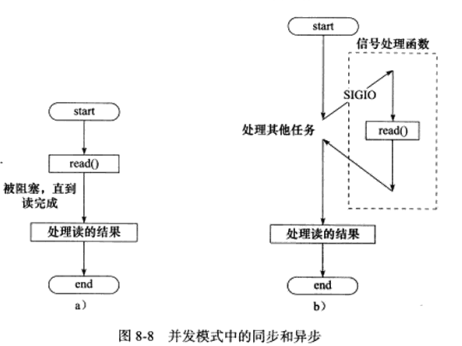
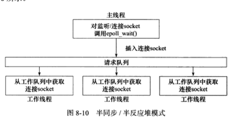
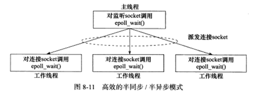
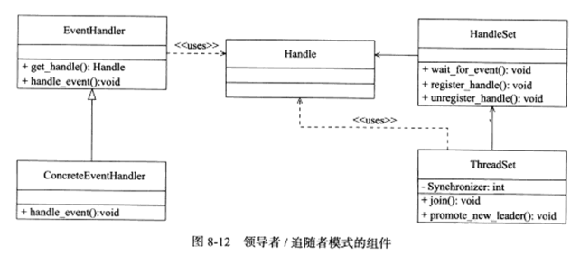

# 高性能服务器程序框架

## 服务器模型

### C/S模型
所有的客户端都通过访问服务器来获取所需的资源。

**服务器端：**创建一个监听socket，将其绑定到感兴趣的端口上，调用listen等待客户端连接。

**客户端：**创建一个连接的socket，并向客户端发起连接请求。

### P2P模型

每台主机在消耗服务的同时也提供服务。但是当用户之间的请求过多时，网络的负载会较大。因此实际的P2P模型一般会加上一个发现服务器（使每个客户能尽快找到自己所需的资源）。

## 服务器编程框架

基本框架如上图。

* I/O 处理单元是服务器管理客户连接的模块。主要负责以下工作：等待并接受新的客户连接，接受客户数据，将服务器响应数据返回给客户端。

* 一个逻辑单元通常是一个进程或一个线程。主要作用是分析和处理客户数据，然后将结果传递给I/O处理单元或是直接发送给客户端。

* 网络存储单元顾名思义就是用来存储信息。可以是数据库，缓存，或是文件。

* 请求队列是各单元之间的通信方式的抽象。即各个单元之间协调的一部分，一般由池来实现。

  

## I/O模型

### 阻塞模式

我们建立的socket默认为阻塞模式，其在未得到响应时将会阻塞，直到对应的事件发生为止。在基础API中，默认阻塞的由accept，send，recv，和connect。

### 非阻塞模式

针对非阻塞I/O的系统调用会立刻返回，而不管事件是否已经发生。如果事件没有发生，则返回-1，具体的错误情况要根据errno来区分。一般事件未发生未设置成EAGAIN，EINPROCESS。

显然我们只有在事件已经发生的情况下操作非阻塞I/O，才能达到提高效率的目的。因此，为了确保事件已经发生，其常和I/O复用，SIGNO信号一起使用。

### I/O复用

应用程序通过I/O复用函数向内核注册一组事件，内核通过I/O复用函数把其在就绪的事件告知程序。常用的函数为 select，epoll(poll)，和 epoll_wait。要注意这些**函数本身是阻塞**的（但是带有定时器）。

### SIGNO信号

我们可以为一个文件描述符指定宿主进程，那么被指定的宿主进程将会捕获到SIGNO信号。一旦文件描述符上有事件触发，SIGNO信号对应的函数也会被触发。

### 同步I/O

指I/O的读写操作都是在事件发生之后，用应用程序完成。只有读写完毕才会函数才会返回。[类似于停等]

### 异步I/O

用户可以直接对I/O执行读写操作。读写会立刻返回。

## 事件处理模式

### reactor

一般由同步I/O模型来处理。其要求主线程只负责监听文件描述符上是否有事件发生，有的话就立刻通知工作线程。除此之外，主线程不做任何工作。

### proactor

将所有的I/O操作都交给主线程和内核来进行处理，工作线程只负责逻辑业务。

### 区别

可以看到，两者的区别在于主进程是否要处理I/O操作。在reactor中，主进程相当于保安，有人来就放进去，而在proactor中，主进程相当于管家，要先看看这个人来是干嘛的，然后再分配给对应的人。由于proactor中主线程要处理I/O，因此同步模型的效率就比较低，这也是其常用异步模型的原因。

### 并发模型

并发是为了使计算机的CPU利用率更高。如果程序是计算密集型的，则没有必要I/O并发，因为切换的效率不高。但如果是I/O密集的，则有空余的线程可以处理计算，提高效率。

#### 半同步/半异步模式

首先要声明这里的同步和异步与I/O中的毫无关联。**在并发模式中，同步指的是程序完全按照代码的顺序执行，异步指的是程序的执行需要由系统事件驱动。**常见的系统事件有信号和中断等。

可以看到例中的异步读需要等待信号的发生。同步线程逻辑简单，条码清晰，而异步线程效率高，但难以调试和部署。

在半同步/半异步模式中，通常逻辑单元是同步线程，主线程则是异步线程。

半同步/半异步模式具有多种变体，如半同步/半反应堆。

反应堆中设置了多个线程，一旦有事件发生，它们将会通过竞争来获得任务的接管权。

但其也存在明显的缺点：1. 主线程和工作线程共享请求队列。主线程往队列中加任务，工作线程则取任务，不同线程的切换之间开销大。2. 每个工作线程在同一时间只能处理一个任务。

下面的方法可以避免该缺点：

由于epoll_wait 的存在，每个工作线程能处理多个任务。

#### 领导者/追随者模式

多个工作线程轮流获得事件源集合(即多个工作线程轮流当主线程)。在任意时刻，都只有一个领导者。其主要流程如下：当当前的领导线程得到I/O事件时，其从线程池中推选出新的领导者，然后再处理自己的I/O事件。

其主要包括以下组件：句柄集、线程集、事件处理器和具体的事件处理器。

* 句柄集：句柄指文件描述符，句柄集则管理众多文件描述符，它使用wait_for_event来监听这些句柄上的I/O事件，并将其中的就绪事件通知给领导者线程。

* 线程集：线程集中的线程只能有三种状态：1.领导者 2. 工作中 3. 追随者。

* 事件处理器和具体的事件处理器：事件处理器通常包含一个或多个回调函数，用于处理事件发生时的业务逻辑。在使用前需要绑定到某个句柄上。

  

## 有限状态机

有的应用层协议头部包括数据包类型字段（如IP的类型字段（IPV4/IPV6），这里忽略IP是网络层协议）。每种类型指定一种服务的逻辑。我们就可以把这个成为一个有限状态机。当然这些状态是相互独立的，没有状态转移机制。

当然我们也可以写带有状态转移的代码，只要执行完当前状态的任务后设定新的状态即可。

## 其他

### 池

池是一组资源的集合，这组资源在服务器启动之初就被完全创建好并被初始化。

### 数据复制

避免不必要的数据复制，尤其是用户空间和内核空间之间的复制。

### 上下文切换和锁

尽量避免使用锁。

