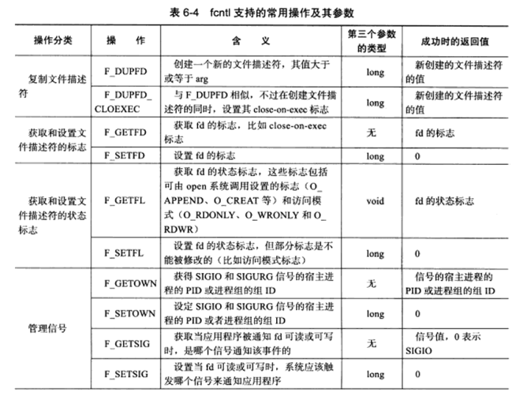
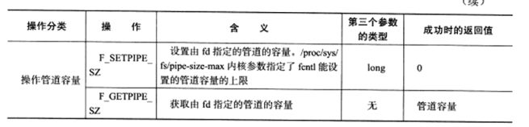

# 高级IO函数

除了上一章的数据交换函数之外，有时我们也需要其他的IO函数。

## 1. pipe函数

pipe函数提供了进程之间的管道通信。

```
#include <unistd.h>
int pipe(int fd[2]);
```

其中，fd[2]数组即构成了管道的两端。并且对于这个管道而言，**数据流向是从fd[1]流向fd[0]的，也就是说我们只能在fd[1]写入数据，在fd[0]读数据**，并且都是阻塞的。此外，和普通的TCP流相比，管道也具有大小限制，最大容量默认为65536byte。

由于管道是单向传递的，因此我们对于一个双向通信的进程而言，我们要建立两个管道。

```
#include <sys/socket>
#include <sys/type.h>
int socketpair(int domain, int type, int protocol, inf fd[2]);
```

该函数将直接建立一个双向的管道（注意管道实际上也是文件！）


## 2.dup/dup2

有时我们希望能将输入/输出重定位到其他文件。这时我们就需要复制文件描述符（多个描述符指向同一个文件！）。

```
#include <unistd.h>
int dup(int fd);
int dup2(int fd, int range);
```

两者的区别在于第二个函数要求生成的新的文件描述符大于range。


## 3. readv/writev

类似于recvmsg的炒作，readv 和 writev 也是将我们的数据连接到多块分片的内存中去。

```
#include <uio.h>
ssize_t readv(int fd, const struct iovec* vector, int count);
ssize_t writev(int fd, const struct iovec* vector, int count);
```


## 4. sendfile

在两个文件之间直接传输数据，效率高！

```
#include <sys/sendfile>
ssize_t sendfile(int out_fd, int in_fd, off_t* offset, size_t count);
```

和其他的IO函数不同，其要求**输入的in必须是文件，而out必须是socket**，其就是为了网络传输文件而生的。	


## 5. mmap/munmap

之前我们进行数据交换的方法主要还是依靠文件来进行的。mmap则允许我们申请一段共享内存空间，我们既可以将其作为共享内存，也可以直接将文件映射到其中。munmap则为我们释放它。

```
#include <sys/mman.h>
void* mmap(void* start, size_t length, int port, int flags, int fd, off_t offset);
int munmap(void* start, size_t length);
```

对于前两个参数比较明确，值得是我们的首地址和长度。我们也可以不指定首地址，则被设置为NULL，

port用于设置内存的访问权限

```
PORT_READ 	//可读
PORT_WRITE	//可写
PORT_EXEC	//可执行
PORT_NONO	//不能访问
```

flags用于设置内存被修改后的行为

```
MAP_SHARED		//进程间共享这段内存 
MAP_PRIVATE		//调用进程私有
MAP_ANONYMOUS	//不是从文件映射而来
MAP_FIXED		//内存必须从start开始
MAP_HUGETLB		//大内存页面
```

fd 则是映射的文件。offset指文件中的偏移。


## 6. splice

splice函数用于在两个文件描述符之间**移动**数据（有点类似sendfile，但sendfile对两者都有限制）

```
#include <fcntl.h>
ssize_t splice(int fd_in, loff_t* off_in, int fd_out, loff_t* off_out,
				size_t len, unsigned int flags);
```

splice可以对所有的文件描述符进行移动数据，但是如果该文件描述符是管道的话 offset 必须设置为NULL。关于flag的具体含义如下表示：

```
SPLICE_F_MOVE
SPLICE_F_NONBLOCK 	//非阻塞
SPLICE_F_MORE		//后续还有splice操作
SPLICE_F_GIFT
```

使用solice时，输入和输出必须至少有一个是管道。


## 7. tee

在两个管道之间复制数据。注意这是**复制**而不是移动！

```
#include <fcntl.h>
ssize_t tee(int fd_in, int fd_out, size_t length, unsigned int flags);
```

其和splice函数作用类似，只不过一个是复制一个是移动。


## 8. fcntl

fcntl很难理解函数名，实际上这是 file control的简写，其提供了对文件描述符的各种操作。

```
#include <fcntl.h>
int fcntl(int fd, int cmd, ...);
```

fcntl有许多重载，根据cmd的不同，其第三个参数的形式也不同，如下表所示。





我们常用的操作是将文件描述符变为非阻塞的。

```
int setnonblocking(int fd){
	int old_option = fcntl(fd, F_GETFL);
	int new_option = old_option | O_NONBLOCK;
	fcntl(fd, F_SETFL, new_option);
	return old_option;
}
```

